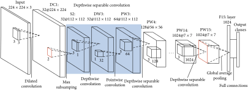

# GUI Rendering State Classification
<p align="center">
 
</p>
<p align="center">Figure: MobileNetV2 architecture.<p align="center">

In this phase, we identify whether the GUI is fully rendered which allows testing tools to execute the next event; or whether the GUI is partially rendered which waits until the rendering is complete.

## Overview
We adopt an implementation of MobileNetV2[^1], which distills the best practices in convolutional network design into a simple architecture that can serve as competitive performance but keep low parameters and mathematical operations to reduce computational cost and memory overhead.

## Train/Evaluate the model

Run the script on constructed dataset
```
OUTPUT_DIR=$(date +"%m-%d-%T")
DATA_PATH="/user-data/binaryUI_app"

python train.py --output_dir ${OUTPUT_DIR} \
                 --data_path ${DATA_PATH} \
                 --do_train \
                 --do_pretrain \
                 --epochs 20 \
                 --num_workers 8 \
                 --model_name mobilenet \
                 --lr 0.01
```

To evaluate the model, use `--do_eval` instead of `--do_train`


## GUI Rendering Inference
1. Prepare the pretrained model. [Our pretrained model](./output/mobilenet/pytorch_model.bin.20)

2. Modify class names in *inference.py*
```
# Make sure the class name in same order for training
CLASS_NAMES = ['fullyrendered', 'partiallyrendered']
```

3. Prepare GUI images in a folder

4. Run inference script
```
IMAGE_FOLDER="image_folder"
MODEL="pytorch_model.bin.20"
MODEL_NAME="mobilenet"

python inference.py --data_path ${IMAGE_FOLDER} \
                    --init_model ${MODEL} \
                    --model_name ${MODEL_NAME} 
```

[^1]: MobileNetV2: Inverted Residuals and Linear Bottlenecks. https://arxiv.org/abs/1801.04381