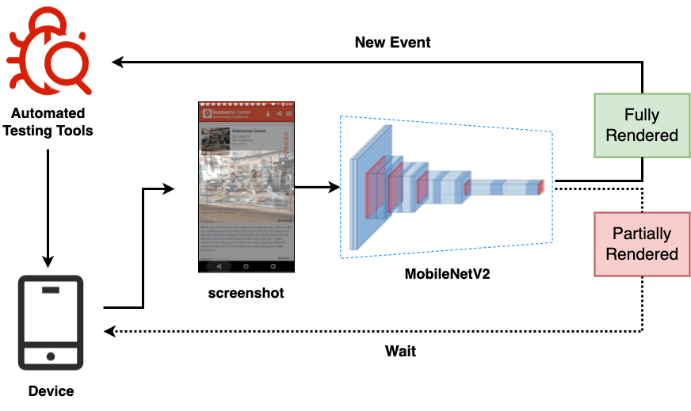

# Approach

 

Figure: The overview of AdaT.

This paper proposes a simple but effective approach AdaT to adaptively adjust the throttle base on GUI screenshots.
Given that automated testing tools test on the device, we synchronously stream the GUI screenshot capturing, and detect its current rendering state.
Based on the GUI rendering inference, we schedule the testing events, which will be sent if the GUI is fully rendered, otherwise, wait explicitly for rendering.

The fundamental of AdaT is to adopt a lightweight CNN-based model to classify the GUI rendering state, which is divided into three main phases:

(i) the [Data Preparation](./dataset_preparation) phase, which automatically collects a large-scale dataset of partially rendered GUIs and fully rendered GUIs,

(ii) the [GUI Rendering State Classification](./GUI_classification) phase that proposes a CNN-based model to discriminate current GUI rendering state,

(iii) the [Model Deployment](model_deployment) phase that proposes an efficient deployment of our model in testing tools.
