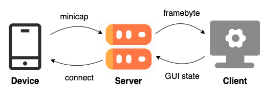

# Model Deployment
<p align="center">
 
</p>
<p align="center">Figure: Overview of model deployment.</p>

To make the model efficiently provide feedback of GUI rendering state to the automated testing tool, synchronization of the GUI and the testing tool is needed.
However, capturing and transmitting GUI screenshots can be time-consuming.
Therefore, we develop a socket-based smartphone test farm using OpenSTF to stream the real time GUI screenshot, as shown in Figure.

## Overview

- **Device Side.**
We utilize the mature and efficient binary method Minicap[^1], to capture screenshots on the device. 
In detail, the screenshots are stored as a binary format, where the first 4 bits represent the screenshot size $n$ and the next $n$ bits represent the screenshot buffer.

- **Server Side.**
It is used to keep a device tracker (e.g., daemon) to manage whenever a device is connected or if the device gets disconnected.

- **Client Side.**
We leverage the websocket to keep receiving the screenshot buffer from the server.
Once the screenshot buffer is received, we decode it into a PyTorch tensor.
This tensor is then fed into our trained GUI state classification model to infer the rendering state of current GUI.
If it is fully rendered, we continue to test on the new event, otherwise, we explicitly wait for the next screenshot buffer.


## Deployment

1. Build Minicap (Optional)
    - get ABI via `adb shell getprop ro.product.cpu.abi`
    - get AndroidVersion via `adb shell getprop ro.build.version.sdk`
    - find minicap version in `./resources/libs/{ABI}/minicap`
    - find minicap.so version in `./resources/jni/libs/android-{AndroidVersion}/{ABI}/minicap.so`
    - push to device via `adb push {minicap} /data/local/tmp/minicap-devel` and `adb push {minicapso} /data/local/tmp/minicap-devel`
    - set permission via `adb shell chmod 777 /data/local/tmp/minicap-devel/*`

2. Apply app under test
```
APK_PATH="test.apk"
SERIAL="emulator-5556"
OUTPUT_DIR="screenshots"

python start.py --apk ${APK_PATH} \
                --device_serial ${SERIAL} \
                --output_dir ${OUTPUT_DIR}
```

3. If define the output directory, the captured GUI screenshots will be saved.


[^1]: Minicap: https://github.com/openstf/minicap