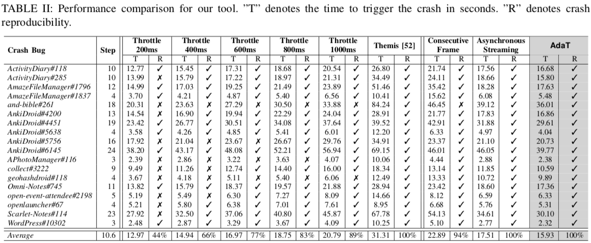

# Experiment for RQ2: Performance of AdaT
As the bugs triggered from partially rendered GUIs might not be encountered by real-world users. Therefore, we used the existing developer-verified bugs to evaluate the ability of the AdaT to efficiently trigger the bugs without affecting the bug triggering capability.

## Testing dataset
We collected 18 testing seeds from 12 Android apps with defects studied in previous work **Themis**[^1].


## Experiment Setup
1. Clone the repoistory, **Themis** (https://github.com/the-themis-benchmarks/home). 
It contains apk file, crash info, replay script, and replay video.

2. Some scripts can not be replayed/verfied due to app content, network, device storage, multi-touch, etc. We revise 18 testing scripts in (*script_revised*).

3. Prepare the emulator or device. We are testing under *Nexus 5X, API 23 Marshmallow*.

4. Open `Developer Setting` > Enable `Don’t keep activities`

5. Ensure delete cache for apps(**Better factory the device**). For example:
* `AmazeFileManager`: Menu > Storage > Alarm > Delete **test** folder. Check script in [AmazeFileManager/script-#1796.py](themis/AmazeFileManager/script-#1796.py)
* `AnkiDroid`: Menu > Setting > Gesture > Disable gesture. Check script in [AnkiDroid/script-#4451.py](themis/AnkiDroid/script-#4451.py)

6. Ensure the emulator orientaion in portrait
```
adb shell content insert --uri content://settings/system --bind name:s:accelerometer_rotation --bind value:i:0
adb shell content insert --uri content://settings/system --bind name:s:user_rotation --bind value:i:0
```

7. Modify the input in [AnkiDroid-log-#5638.json](seed/AnkiDroid-log-#5638.json) for different operating system
```
For windows, "text": "\\&bsol\\;"
For mac and linux, "text": "&bsol;"
```


## Triggering bugs

### AdaT
1. Trigger the bugs under apps
```
SEED_DIR="./seed" 
THEMIS_DIR="./themis"
SERIAL="emulator-5556"
OUTPUT_DIR="./output_ours"
REPLAY_MODE="touch"         

python replay.py --seed_dir ${SEED_DIR} \
                --themis_dir ${THEMIS_DIR} \
                --device_serial ${SERIAL} \
                --output_dir ${OUTPUT_DIR} \
                --replay_mode ${REPLAY_MODE} \
                --use_classifer \
                --use_minicap
```

### Throttling
1. Trigger the bugs under apps (for example, throttle 200ms)
```
SEED_DIR="./seed" 
THEMIS_DIR="./themis"
SERIAL="emulator-5556"
OUTPUT_DIR="./output_throttle_200"
THROTTLE="200"
REPLAY_MODE="touch"         

python replay.py --seed_dir ${SEED_DIR} \
                --themis_dir ${THEMIS_DIR} \
                --device_serial ${SERIAL} \
                --output_dir ${OUTPUT_DIR} \
                --replay_mode ${REPLAY_MODE} \
                --throttle ${THROTTLE} \
```


### Themis (Benchmark)
1. Follow the instructions to prepare Themis (https://github.com/the-themis-benchmarks/home)

2. Trigger the bugs under apps
```
# modify the dir of script_revised in line 94 in replay.py
# python_script = os.path.join('script_revised', app_name, f'script-#{tag}.py')
SEED_DIR="./seed" 
THEMIS_DIR="./themis"
SERIAL="emulator-5556"
OUTPUT_DIR="./output_themis"
REPLAY_MODE="themis"

python replay.py --seed_dir ${SEED_DIR} \
                --themis_dir ${THEMIS_DIR} \
                --device_serial ${SERIAL} \
                --output_dir ${OUTPUT_DIR} \
                --replay_mode ${REPLAY_MODE} \
```


## Results
<p align="center">
 
</p>
AdaT takes an average of 15.93 seconds to reproduce all the bugs. The throttling methods cannot trigger all the bugs, and may trigger the bug that will not be encountered by real-world users. Themis can trigger all of the bugs, but it takes much longer time, on average 31.31 seconds, which is 2x slower than our approach. In addition, leveraging deep learning model and real-time GUI rendering monitor speeds up the testing process than that of the abalation baselines.
In addition, our approach of using single GUI screenshot and real-time GUI rendering monitor speeds up the testing process.
As a result, AdaT does not affect the capability to trigger the bugs, especially those caused by partially rendered GUIs; on the other hand, AdaT can speed up the automated testing, saving much of the time budget in hundreds or thousands of steps in long-term testing.


[^1]: Su, T., Wang, J., & Su, Z. (2021, August). Benchmarking automated GUI testing for Android against real-world bugs. In Proceedings of the 29th ACM Joint Meeting on European Software Engineering Conference and Symposium on the Foundations of Software Engineering (pp. 119-130).