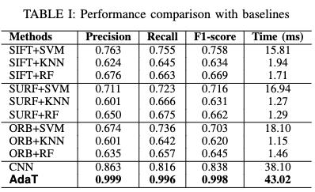

# Experiment for RQ1: Performance of Model

To answer RQ1, we first evaluated the ability of our model [MobileNetV2](../../approach/GUI_classification/) to accurately and efficiently differentiate between fully rendered GUIs and partially rendered GUIs.

## Testing dataset
We split the screens in the dataset by app, completing with the 80%-10%-10% app split for the training, validation, and testing sets, respectively.
The resulting split has 10k GUIs in the testing dataset.

## Machine learning based baselines
We adopted three types of feature extraction methods used in machine learning, e.g., Scale invariant feature transform (SIFT)[^1], Speed up robot features (SURF)[^2], and Oriented fast and rotated brief (ORB)[^3].
With these features, we applied three commonly-used machine learning classifiers, e.g., Support Vector Machine (SVM)[^4], K-Nearest Neighbor (KNN)[^5], and Random Forests (RF)[^6], for classifying the GUI rendering state.

1. Train and evaluate the baselines
```
OUTPUT_DIR="model"
DATA_PATH="binaryUI_app"
IMG_FEATURE="sift"
CLASSIFER="svm"

python train.py --output_dir ${OUTPUT_DIR} \
                 --do_train \
                 --img_feature ${IMG_FEATURE} \
                 --classifer ${CLASSIFER} \
                 --data_path ${DATA_PATH} \
```

## Deep learning based baselines
We also experimented with off-the-shelf feature extraction methods used in deep learning, e.g., traditional CNN with 3 convolutional layers. We used the fully connected layer as a deep learning classifier.

1. Train and evaluate the baselines
    - Follow the instructions in [GUI_classification](../../approach/GUI_classification/)
    - Use `--model_name custom` to evaluate traditional CNN


## Results
<p align="center">
 
</p>
The performance of our model is much better than that of other baselines, i.e., improves 13.6%, 18%, 16% in recall, precision, and F1-score compared with the best baseline (CNN). In addition, our model takes on average 43.02ms per GUI inference, representing the ability of our model to accurately and efficiently discriminate the GUI rendering state.


[^1]: Lowe, D. G. (2004). Distinctive image features from scale-invariant keypoints. International journal of computer vision, 60(2), 91-110.
[^2]: Bay, H., Tuytelaars, T., & Gool, L. V. (2006, May). Surf: Speeded up robust features. In European conference on computer vision (pp. 404-417). Springer, Berlin, Heidelberg.
[^3]: Rublee, E., Rabaud, V., Konolige, K., & Bradski, G. (2011, November). ORB: An efficient alternative to SIFT or SURF. In 2011 International conference on computer vision (pp. 2564-2571). Ieee.
[^4]: Kotsiantis, S. B., Zaharakis, I., & Pintelas, P. (2007). Supervised machine learning: A review of classification techniques. Emerging artificial intelligence applications in computer engineering, 160(1), 3-24.
[^5]: Keller, J. M., Gray, M. R., & Givens, J. A. (1985). A fuzzy k-nearest neighbor algorithm. IEEE transactions on systems, man, and cybernetics, (4), 580-585.
[^6]: Breiman, L. (2001). Random forests. Machine learning, 45(1), 5-32.