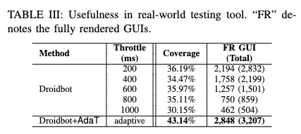

# Experiment for RQ3: Usefulness of AdaT

To answer RQ3, we carried out a usefulness study to assess the performance of our AdaT within the automated testing tools in the real-world testing environment.

We collected 32 Android apps. Details of these apps are shown below.
<p align="center">
 
</p>

## Droidbot+AdaT
1. Prerequisite
    - Python 3.7
    - Java
    - Android SDK
    - Add `platform_tools` directory in Android SDK to `PATH`

2. Install Droidbot with AdaT
```
cd droidbot_adat
pip install -e .
```

If successfully installed, you should be able to execute `droidbot-ours -h`.

3. Automated testing apps
```
APK_FOLDER='select_apks'
OUTPUT_DIR='usefulness_output/ours_10min'
DEVICE='emulator-5556'
TIMEOUT="600"

python apk_explore.py --apk_folder $APK_FOLDER \
                        --output_dir $OUTPUT_DIR \
                        --timeout $TIMEOUT \
                        --interval $INTERVAL \
                        --d $DEVICE
```

## Droidbot
> We are testing in `108d550ab1375063e896abf4f5c9f13ed07460e5` version, Jan 27, 2021.

1. Set up the `Prerequisite` following Droidbot (https://github.com/honeynet/droidbot)

2. Revise the interval to *float*
```
# droidbot/start.py, line 63
parser.add_argument("-interval", type=float)
```

3. Install Droidbot
```
cd droidbot
pip install -e .
```

If successfully installed, you should be able to execute `droidbot -h`.

4. Automated testing apps
```
APK_FOLDER='select_apks'
OUTPUT_DIR='usefulness_output/origin_10min_throttle_200ms'
DEVICE='emulator-5556'
TIMEOUT="600"
INTERVAL="0.2"

# modify line 45 "droidbot-ours" to "droidbot" in apk_explore.py
python apk_explore.py --apk_folder $APK_FOLDER \
                        --output_dir $OUTPUT_DIR \
                        --timeout $TIMEOUT \
                        --interval $INTERVAL \
                        --d $DEVICE
```

## Evaluate Activity Coverage
1. To obtain the activities in an app from AndroidManifest.xml, we use *Fastbot*
```
APK_FOLDER='select_apks'
OUTPUT_DIR='activities'
DEVICE='emulator-5556'

python get_activities.py --apk_folder $APK_FOLDER \
                            --output_dir $OUTPUT_DIR \
                            --d $DEVICE
```

2. Measure activity coverage
```
# define the output of droidbot and activities
droidbot_dir = 'usefulness_output/origin_10min_throttle_200ms'
fastbot_dir = 'usefulness_output/activities'

python analyse_coverage.py
```

## Evaluate GUI Screenshots
1. Mannually annotate the GUI screenshots using VOTT

2. Measure GUIs
```
# define the output of droidbot and annotation
droidbot_dir = 'usefulness_output/origin_10min_throttle_200ms'
annotation_dir = 'usefulness_output/origin_10min_throttle_200ms_annotation'

python analyse_screenshot.py
```

## Results
<p align="center">
 
</p>
Droidbot+AdaT achieves a median activity coverage of 43.14% across 32 Android apps, which is 6.95% higher even compared with the best baseline (e.g., 36.19% in Throttle 200ms). In addition, Droidbot+AdaT explores 3,207 GUI states, and 88.81% are fully rendered, indicating the effectiveness and efficiency of our approach in covering most of the activities and fully rendered GUIs in real-world testing environments.


