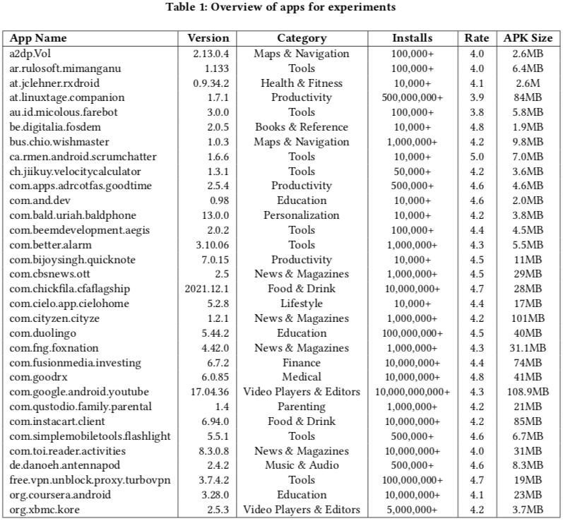
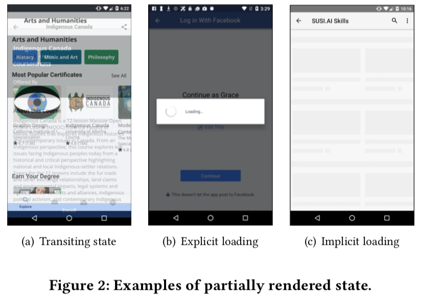
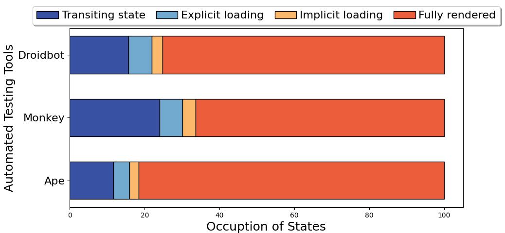
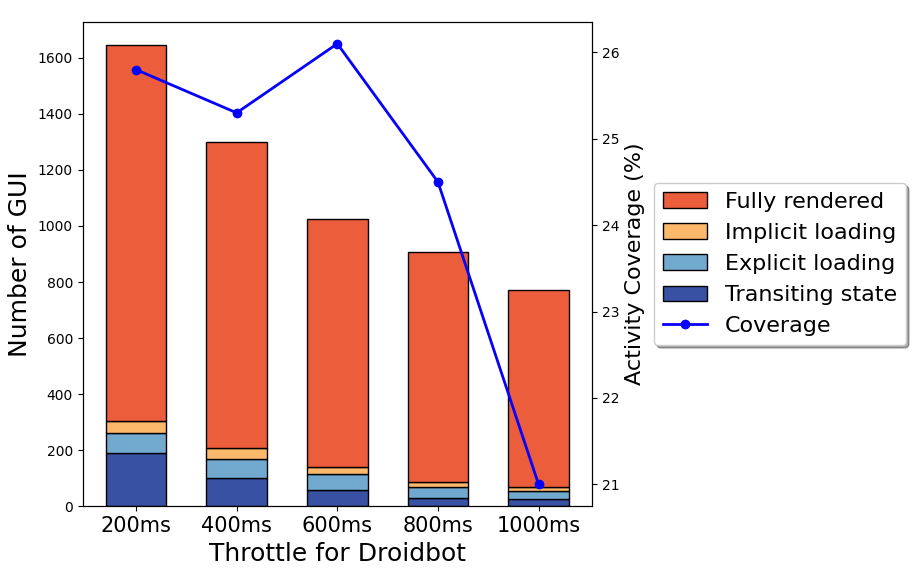

# Motivational Study of Automated Testing Tools
To better understand the issues of automated testing tools with throttling, we carried out a pilot study to examine the prevalence of these issues, so as to facilitate the development of our tool to enhance the existing Android testing tools.

## Experiment Setup
1. We collected 32 Android apps. Details of these apps are shown below.
<p align="center">
 
</p>

2. We used Android emulator (Nexus-5X of Android 6.0). Emulator was allocated with 4 dedicated CPU cores, 2GiB of RAM, and 2GiB of internal storage space.

## Start Automated Testing
### Find the device's serial number
```
adb devices
```

### Detailed Instructions
This directory includes the supported testing tools for Android. These tools can be cloned from repositories. Set up the testing environment according to their instructions.

* `Droidbot`: https://github.com/honeynet/droidbot
* `Monkey`: https://developer.android.com/studio/test/other-testing-tools/monkey
* `Ape`: https://github.com/the-themis-benchmarks/ape-bin


### Droidbot ###
1. cd to droidbot directory
```
APK_FOLDER='apks'
OUTPUT_DIR='droidbot_output_timeout_180_throttle_200'
DEVICE='emulator:5554'

# automated explore apk
python apk_explore.py --apk_folder ${APK_FOLDER} \
                        --output_dir ${OUTPUT_DIR} \
                        --timeout 180 \
                        --interval 0.2 \
                        --d ${DEVICE}
```


### Monkey ###
1. cd to monkey directory

```
APK_FOLDER='apks'
OUTPUT_DIR='monkey_output_timeout_180_throttle_200'
DEVICE='emulator:5554'

# automated explore apk
python apk_explore.py --apk_folder ${APK_FOLDER} \
                        --output_dir ${OUTPUT_DIR} \
                        --timeout 180 \
                        --interval 0.2 \
                        --d ${DEVICE}
```

### Ape ###
1. cd to ape directory

```
APK_FOLDER='apks'
OUTPUT_DIR='ape_output_timeout_180_throttle_200'
DEVICE='emulator:5554'

# automated explore apk
python apk_explore.py --apk_folder ${APK_FOLDER} \
                        --output_dir ${OUTPUT_DIR} \
                        --timeout 180 \
                        --interval 0.2 \
                        --d ${DEVICE}
```


### Annotation
1. We use VoTT, an open source annotation and labeling tool developed by Microsoft, for GUI screenshot annotation.
* `Vott`: https://github.com/microsoft/VoTT

2. The two recurited annotators first annotate the GUI screenshots independently without any discussion, and then meet and discuss the discrepancies until consensus is reached.

## Categorizing GUI rendering state
<p align="center">
 
</p>

* **Fully Rendered State.** A fully rendered state represents a complete transition to the GUI with all resources loaded.

* **Transiting State.** One state is transiting to the next state.
As the transition between states takes longer than the throttle, two GUIs are overlapped with each other.

* **Explicit Loading State.** Depicts a loading bar in the GUI, such as spinning wheel, linear progressing bar, etc.
It explicitly indicates the process or rendering is in progress.

* **Implicit Loading State.** Some resources are not showing due to network latency or resource defects.


## Are partially rendered states common in testing tools?
<p align="center">
 
</p>

1. Analysis of the occupation of partially rendered issues in Automated Testing Tools, including Droidbot, Monkey, Ape with throttle 200ms
```
'Tools': ['Ape', 'Monkey', 'Droidbot'],
'Transiting state': [192, 678, 137],
'Explicit loading': [70, 175, 55],
'Implicit loading': [41, 97, 25],
'Fully rendered': [1343, 1880, 658]
```

2. Display the result
```
# draw_plot.py
def draw_automated_testing_tools_barplot():
    ...
```

> We find that they all encounter the issue with partially rendered states, which may negatively influence the effectiveness when testing.


## How to address partially rendered states?
<p align="center">
 
</p>

1. The simplest way is to set a longer throttle interval, extending the inter-event time for transiting or loading.

2. Analysis of how throttle affects the testing tool by running Droidbot with 5 different throttle intervals, including 200ms, 400ms, 600ms, 800ms, and 1000ms.
```
'Throttle': ['200ms', '400ms', '600ms', '800ms', '1000ms'],
'Transiting state': [192, 102, 60, 31, 26],
'Explicit loading': [70, 67, 54, 39, 29],
'Implicit loading': [41, 38, 25, 16, 14],
'Fully rendered': [1343, 1092, 884, 821, 701],
'Activity coverage': [25.8, 25.3, 26.1, 24.5, 21]
```

3. Display the result
```
# draw_plot.py
def draw_efficiency_of_throttle_barplot():
    ...
```

> We find that extending throttle can help address the issue with partially rendered states. However, an excessive long throttle can reduce the efficiency of automated exploration.


## Why makes throttle adaptive?
> These findings confirm the importance of throttle setting to automated testing, and motivate us to design an approach for balancing effectiveness and efficiency. Taken in this sense, it is worthwhile developing a new effective and efficient method to dynamically adjust the throttle during testing.